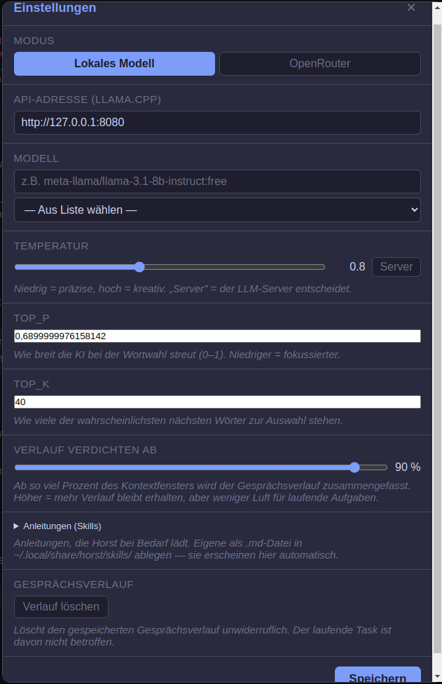
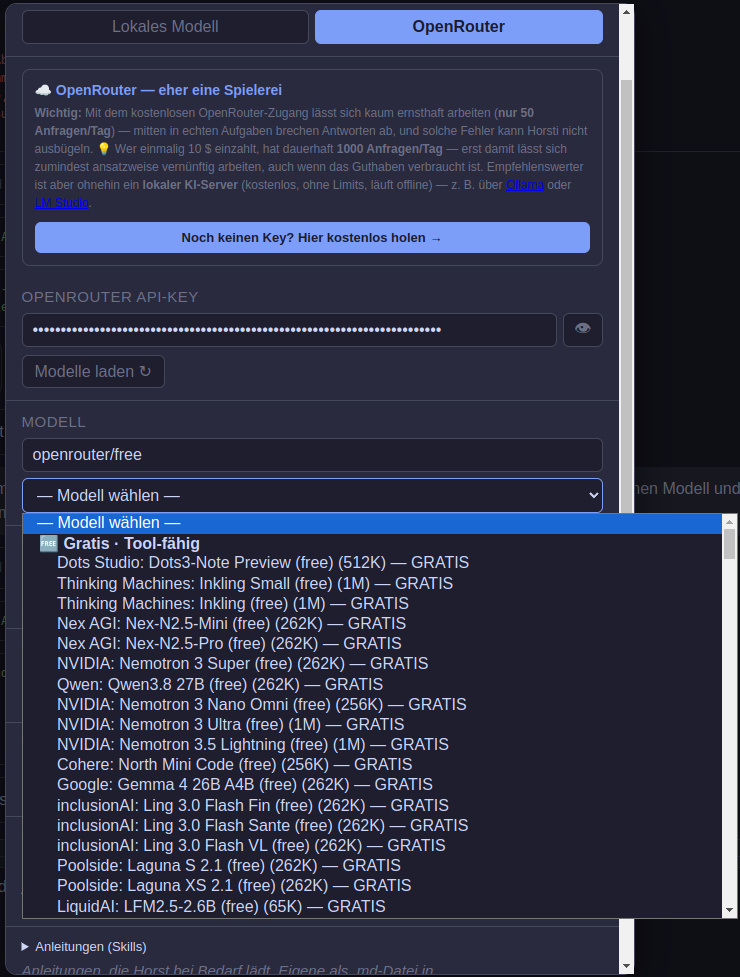

# Horst - KI-Assistent für Linux Einsteiger

Horst ist dein persönlicher Linux-Assistent — kostenlos, einfach, auf Deutsch. Er hilft dir bei allen Linux-Themen: Software installieren, Dateien verwalten, System-Einstellungen, Programmieren und mehr.

## Was Horst kann

- **Kaputte Updates retten** — Abgebrochene oder fehlerhafte System-Updates reparieren, Abhängigkeiten reparieren
- **Fenster bedienen** — Programme mit Knöpfen, Formularen und Dialogen steuern
- **D-Bus steuern** — Lautstärke, Medienplayer, Desktop-Dienste, Systemdienste
- **Internet recherchieren** — Suchen, Webseiten lesen, Treffer aufrufen, Bilder herunterladen
- **Code schreiben** — Programme programmieren, testen, Fehler beheben
- **System und Dienste** — Services starten/stoppen, Konfigurationen ändern, Benutzer verwalten
- **Hardware erkennen** — Festplatten, Grafikkarten, Drucker, Netzwerkgeräte
- **Sicherheit** — Firewall, SSH, Berechtigungen, Updates sichern
- **Dateien durchsuchen** — Nach Namen und Inhalt suchen, große Projekte durchforsten
- **Pläne erstellen** — Komplexe Aufgaben in Schritte zerlegen und abarbeiten

## Installation

**[📥 Horst-Installer 0.1.238 herunterladen (ZIP)](https://github.com/Huppat/horst/releases/download/Agent/Horst-Installer-0.1.238.zip)**

**Voraussetzungen:** Mindestens ein lokaler KI-Server (entweder llama.cpp oder LM Studio) oder ein Open-Router Account (wird bald erweitert).

**Hinweis:** Der Installer ist aktuell nur für Arch Linux verfügbar. Ubuntu folgt in Kürze.

Entpacke den Installer und führe ihn aus:

```bash
# Installer ausführbar machen
chmod +x Horst-Installer-0.1.238

# Horst installieren
./Horst-Installer-0.1.238
```

## Startoptionen

- `horsti` — Normaler Start mit Electron-Oberfläche
- `horsti --help` — Alle Optionen anzeigen
- `horsti --version` — Versionsnummer anzeigen
- `horsti --debug` — Debug-Modus für Fehleranalyse

## Modell-Start-Skript

Zum Starten des lokalen KI-Servers (Qwen3.6-35B-A3B) steht ein vorkonfiguriertes Skript zur Verfügung:

**[📄 start-Qwen3.6-35B-A3B-Q6-MTP-GGUF.sh](https://github.com/Huppat/horst/blob/master/start-Qwen3.6-35B-A3B-Q6-MTP-GGUF.sh)**

Dieses Skript startet den `llama-server` mit den empfohlenen Parametern für das Qwen3.6-35B-A3B-Modell mit Vision-Erkennung.

**Wichtig:** Bevor du das Skript ausführst, musst du darin den Pfad zu deinem heruntergeladenen Modell und den Pfad zum llama.cpp-Installationsordner anpassen.

## Nutzung

- **Der Button für Einstellungen und Optionen befindet sich links neben dem Minimieren-Button.**

Horst startet mit einer Electron-Oberfläche. Du stellst Fragen oder gibst Aufgaben — Horst führt sie aus.

### Optionen

Klicke auf den Optionen-Button (links neben dem Minimieren-Button), um die Einstellungen zu öffnen. Es gibt zwei Modi:

**Lokales Modell** — Verbinde Horst mit einem lokalen KI-Server (llama.cpp oder LM Studio):



- **API-Adresse:** Standardmäßig `http://127.0.0.1:8080` (llama.cpp)
- **LM Studio:** Läuft standardmäßig auf einem anderen Port. Entweder den Port in LM Studio ändern oder die API-Adresse hier in den Optionen anpassen.
- **Modell:** Pfad oder Name des geladenen Modells
- **Temperatur:** Steuert Kreativität vs. Präzision (niedrig = präzise, hoch = kreativ)
- **Top_P / Top_K:** Beeinflussen, wie breit die KI bei der Wortwahl streut
- **Verlauf verdichten ab:** Ab welchem Prozentwert des Kontextfensters der Gesprächsverlauf zusammengefasst wird
- **Anleitungen (Skills):** Eigene Anleitungen als `.md`-Datei in `~/.local/share/horst/skills/` ablegen

**OpenRouter** — Verbinde Horst mit dem OpenRouter-Dienst:



- **API-Key:** Einen eigenen OpenRouter API-Key eingeben. Kostenlos gibt es 50 Anfragen/Tag, mit Einzahlung 1000/Tag.
- **Modelle laden:** Verfügbare Modelle aus OpenRouter auswählen
- **Hinweis:** Wer keinen Key hat, kann sich hier kostenlos einen holen: [OpenRouter Key holen](https://openrouter.ai/keys)

**Hinweis zur Beta-Phase:** Starte Horst am besten direkt aus dem Ordner, in dem du arbeiten möchtest. So hast du sofort Zugriff auf deine Dateien.

**Optimierung:** Horst ist auf QWEN 3.5 bis 3.8 optimiert. Vision/Bilderkennung funktioniert nur mit zusätzlicher `.mmproj`-Datei.

**Empfohlenes Modell (mit Vision):**
- [Qwen3.6-35B-A3B-UD-Q6_K.gguf](https://huggingface.co/unsloth/Qwen3.6-35B-A3B-MTP-GGUF/blob/main/Qwen3.6-35B-A3B-UD-Q6_K.gguf)
- [mmproj-BF16.gguf](https://huggingface.co/unsloth/Qwen3.6-35B-A3B-MTP-GGUF/blob/main/mmproj-BF16.gguf)

Dieses Modell, inklusive Vision, läuft auf einer 12 GB Nvidia RTX 4070 Super mit ca. 45 Tokens pro Sekunde.

**Beispiele:**
- "Mein Update ist abgebrochen, reparier das"
- "Welche Festplatten sind angeschlossen?"
- "Stelle die Lautstärke auf 75%"
- "Suche nach einer Anleitung für Git"
- "Erstelle eine Webseite für mein Projekt"
- "Installiere Firefox und konfiguriere die Firewall"

## Spenden

Horst ist zwar grundsätzlich kostenlos, aber nicht Open Source. Wenn du die Weiterentwicklung und schnelle Bereitstellung neuer Funktionen unterstützen möchtest, kannst du gerne spenden.

[**Spenden via PayPal**](https://paypal.me/huppat)

## Lizenz

Horst ist freie Software.

## Beta-Test

Du möchtest Horst als Beta-Tester testen? Lade dir den Installer herunter und schreib uns eine Nachricht auf GitHub.

## Bekannte Fehler

- **Linux Mint 22:** Ein Bug kann dazu führen, dass Horst das Betriebssystem herunterfährt oder neu startet.
- **Minimieren-Button:** Der Minimieren-Button in der Electron-Oberfläche funktioniert (noch) nicht.
- **Schließen-Button:** Der Schließen-Button schließt Horst nicht vollständig, sondern minimiert ihn in den Task-Manager.
- **Liste nicht vollständig, frühe Beta-Version**

## Einschränkungen

- **Externe Modelle:** Zurzeit sind externe Sprachmodelle nur über OpenRouter verfügbar.

## Tipps

- **Horst vollständig beenden:** Klicke mit der rechten Maustaste auf das Horst-Icon in der Taskleiste und wähle „Beenden".
- **Arch Linux:** Horst läuft unter Arch Linux (bzw. CachyOS) am besten.
